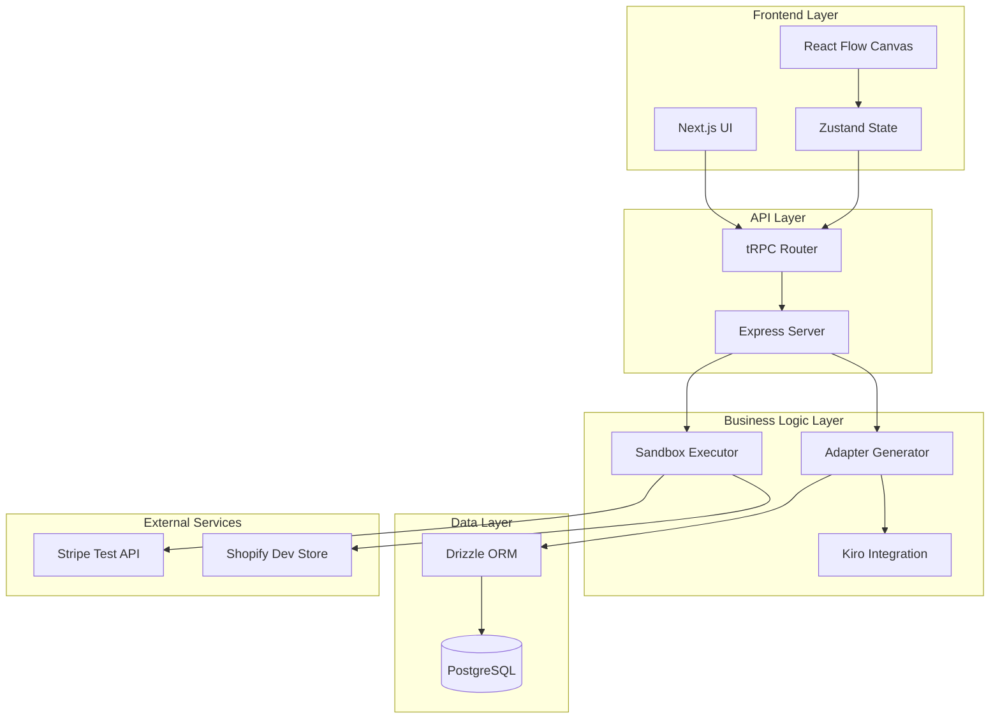
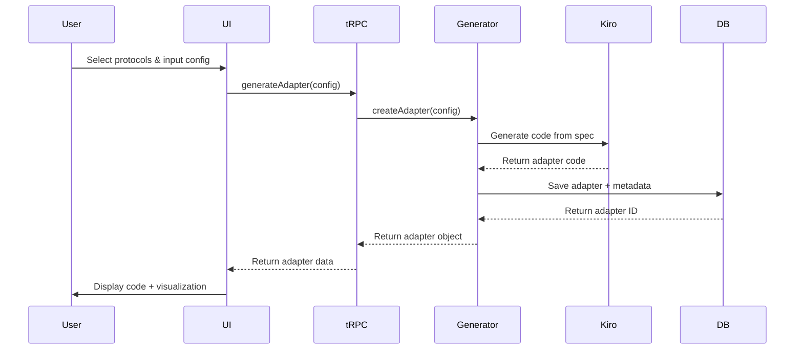
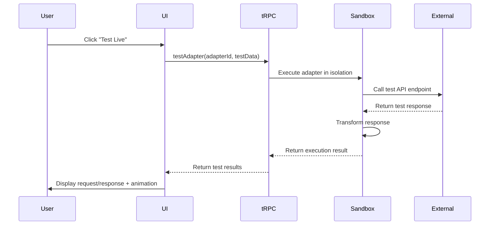

# Design Document

## Overview

FrankenStack is a full-stack web application that generates protocol adapters using AI. The system consists of a Next.js frontend with React Flow visualization, an Express backend with tRPC for type-safe APIs, PostgreSQL database for persistence, and deep integration with Kiro for AI-powered code generation. The architecture follows a client-server model with clear separation between presentation, business logic, and data layers.

## Architecture

### System Components



### Component Descriptions

**Frontend Layer:**
- **Next.js UI**: Server-side rendered React application handling routing, pages, and user interactions
- **React Flow Canvas**: Visual node-based interface for displaying protocol connections and data flow
- **Zustand State**: Lightweight state management for adapter configurations, UI state, and real-time updates

**API Layer:**
- **tRPC Router**: Type-safe API endpoints providing procedures for adapter generation, retrieval, and testing
- **Express Server**: HTTP server hosting tRPC router and serving Next.js application

**Business Logic Layer:**
- **Adapter Generator**: Core service that orchestrates adapter creation using Kiro's code generation
- **Kiro Integration**: Interface to Kiro's AI capabilities, specs, and code generation features
- **Sandbox Executor**: Isolated environment for running generated adapters with security constraints

**Data Layer:**
- **Drizzle ORM**: Type-safe database query builder for adapter CRUD operations
- **PostgreSQL**: Relational database storing adapter code, configurations, and metadata

**External Services:**
- **Stripe Test API**: Mock payment processing for REST adapter testing
- **Shopify Dev Store**: Test e-commerce data for GraphQL adapter testing

## Data Flow

### Adapter Generation Flow



### Live Testing Flow



## Components and Interfaces

### Frontend Components

#### ProtocolSelector Component
```typescript
interface ProtocolSelectorProps {
  onProtocolsSelected: (source: Protocol, target: Protocol) => void;
  availableProtocols: Protocol[];
}

type Protocol = 'REST' | 'GraphQL' | 'gRPC' | 'SOAP' | 'WebSocket';
```

**Responsibilities:**
- Render 5 protocol nodes with Frankenstein theme styling
- Handle protocol selection with visual feedback
- Enforce two-protocol selection limit
- Emit selection events to parent component

#### ConfigurationForm Component
```typescript
interface ConfigurationFormProps {
  sourceProtocol: Protocol;
  targetProtocol: Protocol;
  onSubmit: (config: AdapterConfig) => void;
}

interface AdapterConfig {
  inputMethod: 'documentation' | 'natural-language';
  sourceEndpoint?: string;
  targetEndpoint?: string;
  description?: string;
  examplePayload?: object;
}
```

**Responsibilities:**
- Display input options based on selected protocols
- Validate API documentation format
- Accept natural language descriptions (min 50 chars)
- Submit configuration to adapter generator

#### VisualLabCanvas Component
```typescript
interface VisualLabCanvasProps {
  sourceProtocol: Protocol;
  targetProtocol: Protocol;
  adapterCode: string;
  isExecuting: boolean;
}
```

**Responsibilities:**
- Render React Flow canvas with protocol nodes
- Display data flow connections with stitching patterns
- Animate lightning effects during execution
- Show transformation steps as intermediate nodes

#### CodeViewer Component
```typescript
interface CodeViewerProps {
  code: string;
  language: string;
  onDownload: () => void;
}
```

**Responsibilities:**
- Display syntax-highlighted adapter code
- Provide scrollable editor with line numbers
- Handle code download with proper filename
- Support copy-to-clipboard functionality

### Backend Services

#### AdapterGeneratorService
```typescript
class AdapterGeneratorService {
  async generateAdapter(config: AdapterConfig): Promise<Adapter> {
    // 1. Load appropriate Kiro spec from .kiro/specs/
    // 2. Build prompt with user configuration
    // 3. Call Kiro code generation API
    // 4. Validate generated code syntax
    // 5. Save to database
    // 6. Return adapter object
  }
  
  async getAdapter(id: string): Promise<Adapter> {
    // Retrieve adapter from database by ID
  }
  
  async listAdapters(userId: string): Promise<Adapter[]> {
    // Get all adapters for a user
  }
}

interface Adapter {
  id: string;
  sourceProtocol: Protocol;
  targetProtocol: Protocol;
  code: string;
  config: AdapterConfig;
  createdAt: Date;
  userId: string;
}
```

#### KiroIntegrationService
```typescript
class KiroIntegrationService {
  async generateCode(spec: string, userInput: string): Promise<string> {
    // Interface with Kiro's code generation
    // Uses specs from .kiro/specs/[protocol]-adapter.yaml
  }
  
  async validateCode(code: string, protocol: Protocol): Promise<ValidationResult> {
    // Use Kiro diagnostics to check generated code
  }
}

interface ValidationResult {
  isValid: boolean;
  errors: string[];
  warnings: string[];
}
```

#### SandboxExecutorService
```typescript
class SandboxExecutorService {
  async executeAdapter(
    adapterCode: string,
    testData: object
  ): Promise<ExecutionResult> {
    // 1. Create isolated VM context
    // 2. Load adapter code
    // 3. Execute with test data
    // 4. Capture request/response
    // 5. Return results with timing
  }
}

interface ExecutionResult {
  success: boolean;
  request: object;
  response: object;
  transformedData: object;
  executionTime: number;
  error?: string;
}
```

### tRPC API Routes

```typescript
const appRouter = router({
  // Adapter generation
  generateAdapter: publicProcedure
    .input(z.object({
      sourceProtocol: z.enum(['REST', 'GraphQL', 'gRPC', 'SOAP', 'WebSocket']),
      targetProtocol: z.enum(['REST', 'GraphQL', 'gRPC', 'SOAP', 'WebSocket']),
      config: AdapterConfigSchema
    }))
    .mutation(async ({ input }) => {
      // Call AdapterGeneratorService
    }),
  
  // Retrieve adapter
  getAdapter: publicProcedure
    .input(z.object({ id: z.string() }))
    .query(async ({ input }) => {
      // Call AdapterGeneratorService.getAdapter
    }),
  
  // List user's adapters
  listAdapters: publicProcedure
    .query(async () => {
      // Call AdapterGeneratorService.listAdapters
    }),
  
  // Test adapter live
  testAdapter: publicProcedure
    .input(z.object({
      adapterId: z.string(),
      testData: z.object({}).passthrough()
    }))
    .mutation(async ({ input }) => {
      // Call SandboxExecutorService
    })
});
```

## Data Models

### Database Schema (Drizzle)

```typescript
// schema/adapters.ts
export const adapters = pgTable('adapters', {
  id: uuid('id').primaryKey().defaultRandom(),
  userId: varchar('user_id', { length: 255 }).notNull(),
  sourceProtocol: varchar('source_protocol', { length: 50 }).notNull(),
  targetProtocol: varchar('target_protocol', { length: 50 }).notNull(),
  code: text('code').notNull(),
  config: jsonb('config').notNull(),
  createdAt: timestamp('created_at').defaultNow().notNull(),
  updatedAt: timestamp('updated_at').defaultNow().notNull()
});

export const adapterExecutions = pgTable('adapter_executions', {
  id: uuid('id').primaryKey().defaultRandom(),
  adapterId: uuid('adapter_id').references(() => adapters.id).notNull(),
  success: boolean('success').notNull(),
  executionTime: integer('execution_time').notNull(), // milliseconds
  request: jsonb('request'),
  response: jsonb('response'),
  error: text('error'),
  executedAt: timestamp('executed_at').defaultNow().notNull()
});
```

### TypeScript Types

```typescript
// types/adapter.ts
export type Protocol = 'REST' | 'GraphQL' | 'gRPC' | 'SOAP' | 'WebSocket';

export interface AdapterConfig {
  inputMethod: 'documentation' | 'natural-language';
  sourceEndpoint?: string;
  targetEndpoint?: string;
  description?: string;
  examplePayload?: Record<string, unknown>;
  authentication?: AuthConfig;
}

export interface AuthConfig {
  type: 'api-key' | 'bearer' | 'oauth';
  credentials: Record<string, string>;
}

export interface Adapter {
  id: string;
  userId: string;
  sourceProtocol: Protocol;
  targetProtocol: Protocol;
  code: string;
  config: AdapterConfig;
  createdAt: Date;
  updatedAt: Date;
}

export interface ExecutionResult {
  success: boolean;
  request: Record<string, unknown>;
  response: Record<string, unknown>;
  transformedData: Record<string, unknown>;
  executionTime: number;
  error?: string;
}
```

## File Structure

```
frankenstack/
├── .kiro/
│   ├── specs/
│   │   ├── frankenstack/
│   │   │   ├── requirements.md
│   │   │   ├── design.md
│   │   │   └── tasks.md
│   │   ├── rest-adapter.yaml          # Kiro spec for REST adapters
│   │   ├── graphql-adapter.yaml       # Kiro spec for GraphQL adapters
│   │   └── adapter-template.yaml      # Base template for all adapters
│   ├── steering/
│   │   ├── adapter-patterns.md        # Coding patterns for adapters
│   │   ├── error-handling.md          # Error handling best practices
│   │   └── testing-strategy.md        # Testing approach
│   └── hooks/
│       └── new-adapter.yaml           # Agent hook for adapter boilerplate
│
├── src/
│   ├── app/                           # Next.js 14 app directory
│   │   ├── page.tsx                   # Home page
│   │   ├── layout.tsx                 # Root layout with theme
│   │   ├── adapters/
│   │   │   └── [id]/
│   │   │       └── page.tsx           # Adapter detail page
│   │   └── api/
│   │       └── trpc/
│   │           └── [trpc]/
│   │               └── route.ts       # tRPC handler
│   │
│   ├── components/
│   │   ├── protocol/
│   │   │   ├── ProtocolSelector.tsx
│   │   │   └── ProtocolNode.tsx
│   │   ├── configuration/
│   │   │   ├── ConfigurationForm.tsx
│   │   │   └── InputMethodToggle.tsx
│   │   ├── visualization/
│   │   │   ├── VisualLabCanvas.tsx
│   │   │   ├── DataFlowConnection.tsx
│   │   │   └── LightningAnimation.tsx
│   │   ├── code/
│   │   │   ├── CodeViewer.tsx
│   │   │   └── DownloadButton.tsx
│   │   └── theme/
│   │       ├── FrankensteinTheme.tsx
│   │       └── LoadingBeaker.tsx
│   │
│   ├── server/
│   │   ├── routers/
│   │   │   ├── adapter.ts             # Adapter tRPC routes
│   │   │   └── _app.ts                # Root router
│   │   ├── services/
│   │   │   ├── AdapterGeneratorService.ts
│   │   │   ├── KiroIntegrationService.ts
│   │   │   └── SandboxExecutorService.ts
│   │   ├── db/
│   │   │   ├── schema/
│   │   │   │   ├── adapters.ts
│   │   │   │   └── executions.ts
│   │   │   ├── client.ts              # Drizzle client
│   │   │   └── migrations/
│   │   └── trpc.ts                    # tRPC setup
│   │
│   ├── lib/
│   │   ├── protocols/
│   │   │   ├── rest/
│   │   │   │   ├── parser.ts          # Parse REST docs
│   │   │   │   └── validator.ts       # Validate REST config
│   │   │   └── graphql/
│   │   │       ├── parser.ts          # Parse GraphQL schemas
│   │   │       └── validator.ts       # Validate GraphQL config
│   │   ├── kiro/
│   │   │   ├── spec-loader.ts         # Load Kiro specs
│   │   │   └── prompt-builder.ts      # Build generation prompts
│   │   └── utils/
│   │       ├── validation.ts
│   │       └── formatting.ts
│   │
│   ├── store/
│   │   └── adapterStore.ts            # Zustand state
│   │
│   └── types/
│       ├── adapter.ts
│       ├── protocol.ts
│       └── execution.ts
│
├── public/
│   ├── sounds/
│   │   ├── thunder.mp3
│   │   └── electrical-hum.mp3
│   └── images/
│       └── lab-background.png
│
├── drizzle/
│   └── migrations/                    # Database migrations
│
├── tests/
│   ├── unit/
│   │   ├── services/
│   │   └── lib/
│   └── integration/
│       └── adapters/
│
├── .env.example
├── drizzle.config.ts
├── next.config.js
├── package.json
├── tailwind.config.ts
└── tsconfig.json
```

## Error Handling

### Error Categories

**1. User Input Errors**
- Invalid protocol selection
- Malformed API documentation
- Missing required configuration fields
- Natural language description too short

**Strategy:** Display friendly error messages in UI with specific guidance on how to fix

**2. Generation Errors**
- Kiro code generation timeout
- Invalid generated code syntax
- Spec file not found
- Unsupported protocol combination

**Strategy:** Log detailed error, show user-friendly message, offer retry with different configuration

**3. Execution Errors**
- Sandbox timeout (>30 seconds)
- Network failure calling external API
- Invalid test data format
- Authentication failure

**Strategy:** Capture full error context, display in test results panel, suggest fixes

**4. Database Errors**
- Connection failure
- Query timeout
- Constraint violation
- Migration failure

**Strategy:** Log error, show generic "service unavailable" message, implement retry logic

### Error Response Format

```typescript
interface ErrorResponse {
  code: string;              // Machine-readable error code
  message: string;           // User-friendly message
  details?: string;          // Technical details for debugging
  suggestions?: string[];    // Actionable suggestions
  retryable: boolean;        // Can user retry the operation
}

// Example
{
  code: 'GENERATION_TIMEOUT',
  message: 'Adapter generation took too long',
  details: 'Kiro code generation exceeded 30 second timeout',
  suggestions: [
    'Try simplifying your configuration',
    'Use documentation input instead of natural language'
  ],
  retryable: true
}
```

### Error Handling in Components

```typescript
// Frontend error handling pattern
try {
  const adapter = await trpc.generateAdapter.mutate(config);
  setAdapter(adapter);
} catch (error) {
  if (error instanceof TRPCClientError) {
    const errorData = error.data as ErrorResponse;
    toast.error(errorData.message);
    if (errorData.suggestions) {
      setSuggestions(errorData.suggestions);
    }
  } else {
    toast.error('An unexpected error occurred');
    console.error(error);
  }
}
```

### Error Handling in Services

```typescript
// Backend error handling pattern
class AdapterGeneratorService {
  async generateAdapter(config: AdapterConfig): Promise<Adapter> {
    try {
      const code = await this.kiroService.generateCode(spec, config);
      return await this.saveAdapter(code, config);
    } catch (error) {
      if (error instanceof KiroTimeoutError) {
        throw new TRPCError({
          code: 'TIMEOUT',
          message: 'Adapter generation took too long',
          cause: error
        });
      }
      // Re-throw unexpected errors
      throw error;
    }
  }
}
```

## Testing Strategy

### Unit Testing

**Target:** Individual functions and utilities
**Framework:** Vitest
**Coverage Goal:** 70% for utility functions

**Focus Areas:**
- Protocol parsers and validators
- Data transformation logic
- Prompt building for Kiro
- Error handling utilities

**Example:**
```typescript
describe('REST Parser', () => {
  it('should extract endpoints from OpenAPI spec', () => {
    const spec = loadFixture('openapi-stripe.json');
    const endpoints = parseRestSpec(spec);
    expect(endpoints).toHaveLength(5);
    expect(endpoints[0].method).toBe('POST');
  });
});
```

### Integration Testing

**Target:** Service interactions and database operations
**Framework:** Vitest + Testcontainers (PostgreSQL)
**Coverage Goal:** Key user flows

**Focus Areas:**
- Adapter generation end-to-end
- Database CRUD operations
- tRPC route handlers
- Sandbox execution

**Example:**
```typescript
describe('Adapter Generation Flow', () => {
  it('should generate and save REST to GraphQL adapter', async () => {
    const config = createTestConfig('REST', 'GraphQL');
    const adapter = await generatorService.generateAdapter(config);
    
    expect(adapter.code).toContain('async function transform');
    expect(adapter.sourceProtocol).toBe('REST');
    
    const saved = await db.query.adapters.findFirst({
      where: eq(adapters.id, adapter.id)
    });
    expect(saved).toBeDefined();
  });
});
```

### End-to-End Testing

**Target:** Complete user workflows through UI
**Framework:** Playwright
**Coverage Goal:** Critical paths only (due to time constraints)

**Focus Areas:**
- Protocol selection → configuration → generation → display
- Live testing with mock APIs
- Download adapter code

**Example:**
```typescript
test('user can generate REST to GraphQL adapter', async ({ page }) => {
  await page.goto('/');
  
  // Select protocols
  await page.click('[data-protocol="REST"]');
  await page.click('[data-protocol="GraphQL"]');
  
  // Configure
  await page.fill('[name="description"]', 'Convert Stripe webhooks to Shopify mutations');
  await page.click('button:has-text("Generate Adapter")');
  
  // Verify result
  await expect(page.locator('.code-viewer')).toBeVisible();
  await expect(page.locator('.visual-lab-canvas')).toBeVisible();
});
```

### Manual Testing Checklist

**Week 2 Testing:**
- [ ] All 5 protocol nodes render correctly
- [ ] Protocol selection enforces 2-protocol limit
- [ ] REST to GraphQL adapter generates valid code
- [ ] GraphQL to REST adapter generates valid code
- [ ] Visual canvas shows data flow connections
- [ ] Lightning animations trigger on test execution
- [ ] Code download works with correct filename
- [ ] Stripe test mode integration works
- [ ] Shopify dev store integration works

**Week 3 Testing:**
- [ ] All spooky theme animations work
- [ ] Sound effects play at correct times
- [ ] Database persists adapters correctly
- [ ] Previously generated adapters load
- [ ] Error messages display helpful suggestions
- [ ] Mobile responsive layout works
- [ ] Performance: Generation completes in <30s
- [ ] Performance: UI animations run at 30fps

## Kiro Integration Details

### Spec Files Structure

Each protocol adapter has a dedicated Kiro spec file that guides code generation:

**rest-adapter.yaml:**
```yaml
adapter_type: REST
capabilities:
  - parse_json_payloads
  - handle_http_methods
  - validate_webhooks
  
code_patterns:
  request_handler: |
    async function handleRequest(req) {
      const payload = await parseBody(req);
      const validated = validatePayload(payload, schema);
      return transform(validated);
    }
    
  error_handler: |
    try {
      // operation
    } catch (error) {
      return {
        status: 'error',
        message: error.message,
        code: error.code
      };
    }
```

### Agent Hooks

**new-adapter hook** (.kiro/hooks/new-adapter.yaml):
```yaml
trigger: command
command: "new-adapter"
description: "Generate boilerplate for a new protocol adapter"

steps:
  - Create adapter service file
  - Create parser utility
  - Create validator utility
  - Add tRPC route
  - Update protocol types
  - Generate test file
```

### Steering Documents

**adapter-patterns.md** (.kiro/steering/adapter-patterns.md):
- Consistent file naming conventions
- Service class structure
- Error handling patterns
- Logging standards

**error-handling.md** (.kiro/steering/error-handling.md):
- Error categories and codes
- User-friendly message guidelines
- Retry logic patterns
- Logging requirements

**testing-strategy.md** (.kiro/steering/testing-strategy.md):
- Test file organization
- Fixture management
- Mock API setup
- Coverage expectations

## Performance Considerations

### Frontend Optimization

- **Code Splitting:** Lazy load React Flow and code editor components
- **State Management:** Use Zustand selectors to prevent unnecessary re-renders
- **Animation Performance:** Use CSS transforms and requestAnimationFrame for 60fps
- **Bundle Size:** Keep initial bundle under 200KB gzipped

### Backend Optimization

- **Database Queries:** Index on userId and createdAt for list queries
- **Code Generation:** Implement 30-second timeout with progress updates
- **Caching:** Cache Kiro specs in memory after first load
- **Connection Pooling:** Configure PostgreSQL pool with max 20 connections

### Sandbox Security

- **Execution Timeout:** Hard limit of 30 seconds per adapter execution
- **Memory Limit:** Restrict VM to 128MB heap
- **Network Restrictions:** Only allow connections to whitelisted test APIs
- **Code Validation:** Parse and validate generated code before execution

## Deployment Architecture

### Development Environment

- **Frontend:** Next.js dev server on localhost:3000
- **Backend:** Express server on localhost:3001
- **Database:** Local PostgreSQL or Supabase development project
- **Kiro:** Local Kiro instance with specs and hooks

### Production Environment (Post-Hackathon)

- **Frontend:** Vercel deployment with automatic preview branches
- **Backend:** Vercel serverless functions
- **Database:** Supabase production project with connection pooling
- **CDN:** Vercel Edge Network for static assets
- **Monitoring:** Vercel Analytics + Sentry for error tracking

## Security Considerations

### Input Validation

- Sanitize all user input before passing to Kiro
- Validate API endpoints are well-formed URLs
- Limit natural language description to 1000 characters
- Prevent code injection in configuration fields

### Sandbox Isolation

- Run generated adapters in isolated VM context
- No access to file system or environment variables
- Network requests limited to test API domains
- Automatic termination after timeout

### API Security

- Rate limiting on adapter generation (5 per minute per user)
- CORS configuration for frontend domain only
- API key validation for external service calls
- No storage of production API credentials

### Data Privacy

- No logging of user API credentials
- Adapter code stored encrypted at rest
- Execution logs retained for 7 days only
- GDPR-compliant data deletion on request
